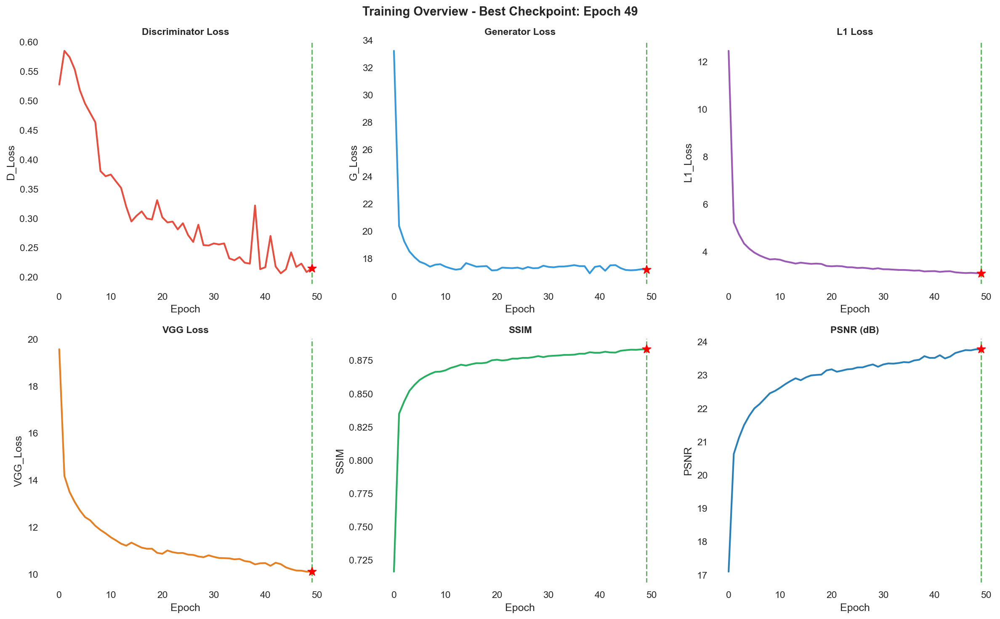

# 🎭 Face Reconstruction Under Mask Occlusion

[](https://python.org)
[](https://pytorch.org)
[](LICENSE)

A deep learning project for reconstructing occluded facial regions using **ImprovedPremiumGAN** - a GAN-based architecture trained on the CelebA-HQ dataset.


---

## 📋 Table of Contents

- [Overview](#-overview)
- [Features](#-features)
- [Project Structure](#-project-structure)
- [Installation](#-installation)
- [Dataset](#-dataset)
- [Model Checkpoints](#-model-checkpoints)
- [Usage](#-usage)
- [Results](#-results)
- [Citation](#-citation)

---

## 🔍 Overview

This project implements a GAN-based approach for face reconstruction, specifically designed to recover facial features hidden by masks or other occlusions. The model learns to generate realistic facial features (nose, mouth, chin) from masked input images.

### Key Highlights:

- **Architecture**: U-Net Generator + PatchGAN Discriminator
- **Loss Functions**: L1 + VGG Perceptual + Adversarial Loss
- **Training Data**: CelebA-HQ 256×256 (27,000 images)
- **Best Performance**: SSIM 0.883, PSNR 23.78 dB after 50 epochs

---

## ✨ Features

- 🖼️ **High-quality face reconstruction** at 256×256 resolution
- 🎯 **Multi-loss training** combining pixel-wise, perceptual, and adversarial losses
- 🔄 **Resume training** from checkpoints
- 📊 **Comprehensive metrics** tracking (SSIM, PSNR, FID, VGG Loss)
- 🧪 **Cross-dataset validation** on FFHQ dataset(3,000 images)

---

## 📁 Project Structure

```
Unmask_System/
├── ImprovedPremiumGAN_celeba/
│   ├── config.py              # Hyperparameters & paths
│   ├── model.py               # Generator & Discriminator architecture
│   ├── dataset.py             # Data loading & preprocessing
│   ├── loss.py                # Loss functions (L1, VGG, Adversarial)
│   ├── train.py               # Training loop
│   ├── test.py                # Testing & evaluation
│   ├── validate.py            # Cross-dataset validation (FFHQ)
│   ├── inference.py           # Single image inference
│   ├── detect.py              # Face detection utilities
│   ├── utils.py               # Helper functions
│   ├── plot_metrics.py        # Training visualization
│   ├── prepare_masked_dataset.py  # Dataset preparation
│   └── results/
│       ├── plots/             # Training curves & statistics
│       └── train_log.csv      # Training metrics log
├── celeba_hq_256/             # Dataset (download separately)
│   ├── without_mask/          # Original images (ground truth)
│   └── with_mask/             # Masked images (input)
├── report.tex                 # LaTeX report
├── .gitignore
└── README.md
```

---

## 🚀 Installation

### Prerequisites

- Python 3.8+
- CUDA-capable GPU (recommended: 8GB+ VRAM)
- PyTorch 2.0+

### Setup

```bash
# Clone the repository
git clone https://github.com/YOUR_USERNAME/Unmask_System.git
cd Unmask_System

# Create virtual environment
python -m venv venv
source venv/bin/activate  # Linux/Mac
# or
.\venv\Scripts\activate   # Windows

# Install dependencies
pip install torch torchvision torchaudio --index-url https://download.pytorch.org/whl/cu118
pip install opencv-python pillow numpy pandas matplotlib seaborn scipy scikit-image tqdm
```

### Required Packages

```
torch>=2.0.0
torchvision>=0.15.0
opencv-python>=4.8.0
pillow>=10.0.0
numpy>=1.24.0
pandas>=2.0.0
matplotlib>=3.7.0
seaborn>=0.12.0
scipy>=1.10.0
scikit-image>=0.21.0
tqdm>=4.65.0
pytorch-fid>=0.3.0  # For FID calculation
```

---

## 📦 Dataset

### CelebA-HQ 256×256

Download the dataset from Kaggle:

- **Link**: [CelebA-HQ 256×256](https://www.kaggle.com/datasets/badasstechie/celebahq-resized-256x256)

After downloading:

1. Extract to `celeba_hq_256/without_mask/`
2. Run the mask generation script:

```bash
cd ImprovedPremiumGAN_celeba
python prepare_masked_dataset.py
```

This will create masked versions in `celeba_hq_256/with_mask/`.

### FFHQ (for validation)

- **Link**: [FFHQ Dataset](https://www.kaggle.com/datasets/arnaud58/flickrfaceshq-dataset-ffhq)

---

## 💾 Model Checkpoints

Pre-trained checkpoints are available for download:

| Model         | Epoch | SSIM  | PSNR     | Download                  |
| ------------- | ----- | ----- | -------- | ------------------------- |
| Generator     | 49    | 0.883 | 23.78 dB | [Google Drive](YOUR_LINK) |
| Discriminator | 49    | -     | -        | [Google Drive](YOUR_LINK) |

### Download & Setup

```bash
# Create checkpoints directory
mkdir -p ImprovedPremiumGAN_celeba/checkpoints

# Download and place files:
# - gen_49.pth.tar
# - disc_49.pth.tar
```

---

## 🎮 Usage

### Training

```bash
cd ImprovedPremiumGAN_celeba

# Train from scratch
python train.py

# Resume training (set LOAD_MODEL=True in config.py)
python train.py
```

### Testing

```bash
# Evaluate on test set
python test.py
```

### Inference on Single Image

```bash
python inference.py --input path/to/masked_image.jpg --output path/to/output.jpg
```

### Cross-Dataset Validation (FFHQ)

```bash
python validate.py --dataset path/to/ffhq --num_images 3000
```

### Plot Training Metrics

```bash
python plot_metrics.py
```

---

## 📊 Results

### Training Performance (50 Epochs)

| Metric         | Initial (Epoch 0) | Best (Epoch 49) | Improvement |
| -------------- | ----------------- | --------------- | ----------- |
| Generator Loss | 33.218            | 17.184          | -48.3%      |
| L1 Loss        | 12.451            | 3.085           | -75.2%      |
| VGG Loss       | 19.567            | 10.118          | -48.3%      |
| SSIM           | 0.716             | 0.883           | +23.3%      |
| PSNR           | 17.10 dB          | 23.78 dB        | +39.1%      |

### Cross-Dataset Validation (FFHQ - 3,000 images)

| Metric               | Value    |
| -------------------- | -------- |
| PSNR (masked region) | 22.01 dB |
| PSNR (full image)    | 29.02 dB |
| SSIM (full image)    | 0.9299   |
| FID Score            | 5.56     |

### Visual Results



---

## 🏗️ Model Architecture

### Generator (U-Net based)

- **Encoder**: 8 downsampling blocks with Conv2d + BatchNorm + LeakyReLU
- **Bottleneck**: 512 channels at 1×1 resolution
- **Decoder**: 8 upsampling blocks with ConvTranspose2d + BatchNorm + ReLU + Skip Connections
- **Output**: Tanh activation, 3 channels (RGB)

### Discriminator (PatchGAN)

- 4 convolutional blocks with increasing channels (64 → 512)
- Final 1×1 convolution for patch-wise real/fake prediction
- No global pooling - provides spatial feedback to generator

### Loss Functions

```
L_total = λ_L1 × L1_Loss + λ_VGG × VGG_Loss + λ_ADV × Adversarial_Loss
```

Where: λ_L1 = 100, λ_VGG = 10, λ_ADV = 1

---

## 📝 Citation

If you use this code in your research, please cite:

```bibtex
@misc{face_reconstruction_gan,
  author = {Your Name},
  title = {Face Reconstruction Under Mask Occlusion using ImprovedPremiumGAN},
  year = {2026},
  publisher = {GitHub},
  url = {https://github.com/YOUR_USERNAME/Unmask_System}
}
```

---

## 📄 License

This project is licensed under the MIT License - see the [LICENSE](LICENSE) file for details.

---

## 🙏 Acknowledgments

- [CelebA-HQ Dataset](https://github.com/tkarras/progressive_growing_of_gans)
- [FFHQ Dataset](https://github.com/NVlabs/ffhq-dataset)
- [pix2pix](https://github.com/junyanz/pytorch-CycleGAN-and-pix2pix) - Architecture inspiration
- [VGG Perceptual Loss](https://arxiv.org/abs/1603.08155)
